# 01-03-JVM

**灵魂三问：**

**JVM是什么？**

- JVM广义上指的是一种规范。狭义上的是JDK中的JVM虚拟机。

**为什么要学习JVM？**

- 面试过程中，经常会被问到JVM。
- 研发过程中，肯定会面临一些重难点问题与JVM有关系。例如：线程死锁、内存溢出、项目性能优化等等。
- 基础不牢，地动山摇。想深入掌握Java这门语言，JVM始终是绕不过去的那座大山，早晚得攀。

**怎么学习JVM？**

JVM虚拟机部分，我们是这么安排的：

1. JVM基本常识
2. 类加载子系统
3. 运行时数据区
4. 一个对象的一生（出生、死亡与内涵）
5. GC垃圾收集器
6. JVM调优相关工具与可调参数
7. 调优实战案例

## 1. JVM虚拟机概述

### 1.1 JVM 基本常识

#### 什么是JVM？

平时我们所说的JVM广义上指的是一种规范。狭义上的是JDK中的JVM虚拟机。JVM的实现是由各个厂商来做的。比如现在流传最广泛的是hotspot。其他实现：BEA公司 JRocket、IBM j9、zing 号称世界最快JVM、taobao.vm。从广义上讲Java，Kotlin、Clojure、JRuby、Groovy等运行于Java虚拟机上的编程语言及其相关的程序都属于Java技术体系中的一员。

Java技术体系主要包括如下四个方面。

- Java程序设计语言
- Java类库API
- 来自商业机构和开源社区的第三方Java类库
  - Google
  - Apache
  - 等等
- **Java虚拟机：各种硬件平台上的Java虚拟机实现**

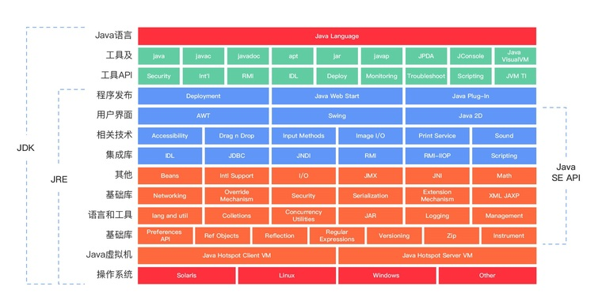

可以简单类比一下：Java虚拟机是宿主，Java代码开发的程序则寄生在宿主上！

#### JVM架构图

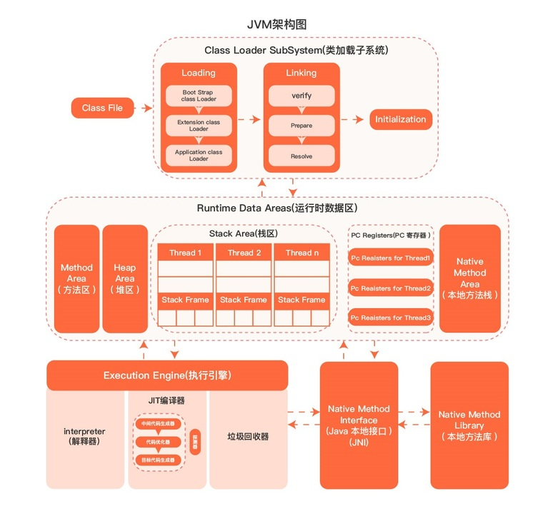

Java和JVM的关系：

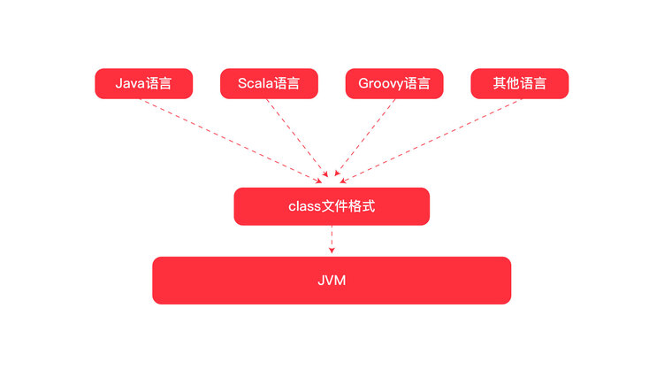

### 1.2 类加载子系统

#### 1.2.1 类加载的时机

类加载主要有四个时机：

1. 遇到`new`、`getstatic`、`putstatic`和`invokestatic`这四条指令时，如果对应的类没有初始化，则要对对应的类先进行初始化。

```java
public class Student{
  private static int age ;
  public static void method(){
  }
}
//Student.age
//Student.method();
//new Student();
```

2. 使用`java.lang.reflect`包方法时，对类进行**反射调用**的时候。

```java
Class c = Class.forname("com.hero.Student");
```

3. 初始化一个类的时候发现其父类还没初始化，要先初始化其父类
4. 当虚拟机开始启动时，用户需要指定一个主类（main），虚拟机会先执行这个主类的初始化。

#### 1.2.2 类加载的过程

**类加载主要做三件事：**

1. 全限定名称                      ==>    二进制字节流加载class文件
2. 字节流的静态数据结构   ==>     方法区的运行时数据结构
3. 创建字节码Class对象

**一个类的一生：**

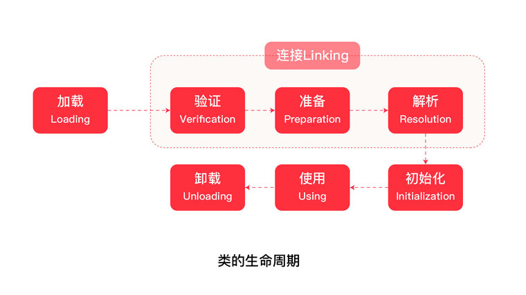

可以从哪些途径加载字节码？


#### 1.2.3 类加载器

**JVM的类加载是通过ClassLoader及其子类来完成的。**


- **检查顺序是自底向上**：加载过程中会先检查类是否被已加载，从Custom ClassLoader到BootStrap ClassLoader逐层检查，只要某个classloader已加载就视为已加载此类，保证此类只所有ClassLoader加载一次。
- **加载的顺序是自顶向下**：也就是由上层来逐层尝试加载此类。

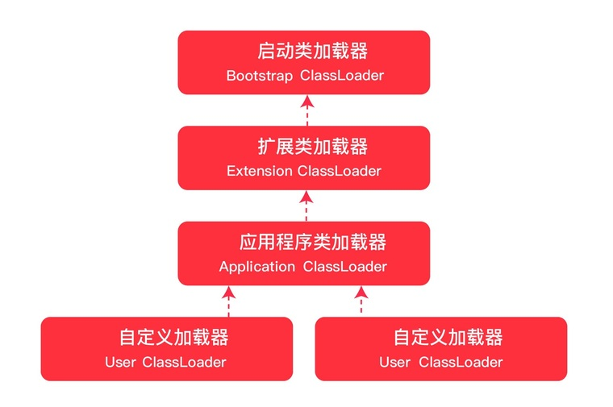

- **启动类加载器(Bootstrap ClassLoader)**：
  - 负责加载 JAVA_HOME\lib 目录中的，或通过-Xbootclasspath参数指定路径中的，且被虚拟机认可（按文件名识别，如rt.jar）的类。由C++实现，不是ClassLoader的子类
- **扩展类加载器(Extension ClassLoader)**：
  - 负责加载 JAVA_HOME\lib\ext 目录中的，或通过java.ext.dirs系统变量指定路径中的类库。
- **应用程序类加载器(Application ClassLoader)**：
  - 负责加载用户路径classpath上的类库
- **自定义类加载器（User ClassLoader）：**
  - 作用：JVM自带的三个加载器只能加载指定路径下的类字节码，**如果某些情况下，我们需要加载应用程序之外的类文件呢？就需要用到自定义类加载器**，就像是在汽车行驶的时候，为汽车更换轮子。
  - 比如本地D盘下的，或者去加载网络上的某个类文件，这种情况就可以使用自定义加载器了。
  - 举个栗子：JRebel


#### 自定义类加载器案例：

目标：自定义类加载器，加载指定路径在D盘下的lib文件夹下的类。

**步骤：**

1. 新建一个需要被加载的类Test.jave
2. 编译Test.jave到指定lib目录
3. 自定义类加载器HeroClassLoader继承ClassLoader：
   - 重写findClass()方法
   - 调用defineClass()方法
4. 测试自定义类加载器

#### 1.2.4 双亲委派模型与打破双亲委派

#### 1）什么是双亲委派？

- **当一个类加载器收到类加载任务，会先交给其父类加载器去完成**。因此，最终加载任务都会传递到顶层的启动类加载器，**只有当父类加载器无法完成加载任务时，子类才会尝试执行加载任务**。

> Oracle 官网文档描述：
> **The Java Class Loading Mechanism**
> The Java platform uses a delegation model for loading classes. The basic idea is that every class loader has a "parent" class loader. When loading a class, a class loader first "delegates" the search for the class to its parent class loader before attempting to find the class itself.—— Oracel Document
> [https://docs.oracle.com/javase/tutorial/ext/basics/load.html](https://docs.oracle.com/javase/tutorial/ext/basics/load.html)
> 看到这里，应该叫父亲委派对吧？那么为什么要叫双亲委派呢，因为最早的翻译者，导致双亲委派的概念流行起来了。

#### 2）为什么需要双亲委派呢？

- <font color="red">考虑到安全因素，双亲委派可以避免重复加载，当父亲已经加载了该类的时候，就没有必要子ClassLoader再加载一次。</font>
- 比如：加载位于rt.jar包中的类java.lang.Object，不管是哪个加载器加载这个类，最终都是委托给顶层的启动类加载器进行加载，这样就保证了使用不同的类加载器最终得到的都是同样一个Object对象。

#### 3）双亲委派机制源码：

```java
protected Class<?> loadClass(String name, boolean resolve)
        throws ClassNotFoundException
    {
        synchronized (getClassLoadingLock(name)) {
            // 首先, 检查class是否被加载，如果没有加载则进行加载
            Class<?> c = findLoadedClass(name);
            if (c == null) {
                long t0 = System.nanoTime();
                try {
                    if (parent != null) {//如果父类加载不为空，则交给父类加载器加载
                        c = parent.loadClass(name, false);
                    } else {
                        c = findBootstrapClassOrNull(name);
                    }
                } catch (ClassNotFoundException e) {
                    // ClassNotFoundException thrown if class not found
                    // from the non-null parent class loader
                }

                if (c == null) {//父类加载器没有加载到，则由子类进行加载
                    // If still not found, then invoke findClass in order
                    // to find the class.
                    long t1 = System.nanoTime();

                    c = findClass(name);

                    // this is the defining class loader; record the stats
                    sun.misc.PerfCounter.getParentDelegationTime().addTime(t1 - t0);
                    sun.misc.PerfCounter.getFindClassTime().addElapsedTimeFrom(t1);
                    sun.misc.PerfCounter.getFindClasses().increment();
                }
            }
            if (resolve) {
                resolveClass(c);
            }
            return c;
        }
    }


```

#### 4）为什么还需要破坏双亲委派？

- <font color="red">在实际应用中，双亲委派解决了Java 基础类统一加载的问题，但是却存在着缺陷。JDK中的基础类作为典型的api被用户调用，但是也存在api调用用户代码的情况，典型的如：SPI代码。这种情况就需要打破双亲委派模式。</font>
- 举个栗子：数据库驱动DriverManager。以Driver接口为例，Driver接口定义在JDK中，其**实现由各个数据库的服务商来提供，由系统类加载器加载**。这个时候就需要**启动类加载器**来 **委托 **子类来加载Driver实现，这就破坏了双亲委派。类似情况还有很多

#### 5）如何破坏双亲委派？

#### 第一种方式

- 在 jdk 1.2 之前，那时候还没有双亲委派模型，不过已经有了 ClassLoader 这个抽象类，所以已经有人继承这个抽象类，**重写 loadClass** 方法来**实现用户自定义类加载器**。
- 而在 1.2 的时候要**引入双亲委派模型**，为了向前兼容， loadClass 这个方法还得保留着使之得以重写，新搞了个 findClass 方法让用户去重写，并呼吁大家不要重写 loadClass 只要重写 findClass。
- 这就是第一次对双亲委派模型的破坏，**因为双亲委派的逻辑在 loadClass 上，但是又允许重写 loadClass，重写了之后就可以破坏委派逻辑了。**

#### 第二种方式：

- 双亲委派机制是一种**自上而下的加载需求，越往上类越基础**。
- SPI代码打破了双亲委派

DriverManager源码

```java
static {
    loadInitialDrivers();
    println("JDBC DriverManager initialized");
}  
  
private static void loadInitialDrivers() {
    String drivers;
    try {
        drivers = AccessController.doPrivileged(new PrivilegedAction<String>() {
            public String run() {
                return System.getProperty("jdbc.drivers");
            }
        });
    } catch (Exception ex) {
        drivers = null;
    }

    AccessController.doPrivileged(new PrivilegedAction<Void>() {
        public Void run() {

            ServiceLoader<Driver> loadedDrivers = ServiceLoader.load(Driver.class);
            Iterator<Driver> driversIterator = loadedDrivers.iterator();   
            try{
                while(driversIterator.hasNext()) {
                    driversIterator.next();
                }
            } catch(Throwable t) {
                // Do nothing
            }
            return null;
        }
    });

    println("DriverManager.initialize: jdbc.drivers = " + drivers);

    if (drivers == null || drivers.equals("")) {
        return;
    }
    String[] driversList = drivers.split(":");
    println("number of Drivers:" + driversList.length);
    for (String aDriver : driversList) {
        try {
            println("DriverManager.Initialize: loading " + aDriver);
            //在这里需要加载各个厂商实现的数据库驱动com.mysql.jdbc.Driver
            Class.forName(aDriver, true,ClassLoader.getSystemClassLoader());
        } catch (Exception ex) {
            println("DriverManager.Initialize: load failed: " + ex);
        }
    }
}
```

**如果出现SPI相关代码时，我们应该如何解决基础类去加载用户代码类呢？**

这个时候，JVM不得不妥协，推出<font color='red' size='3'>**==线程上下文类加载器==**</font>的概念，去解决该问题。这样也就打破了双亲委派

**线程上下文类加载器**

（ThreadContextClassLoader）

**设置线程上下文类加载器源码**

```java
public Launcher() {
    // Create the extension class loader
    ClassLoader extcl;
    try {
        // 扩展类加载器
        extcl = ExtClassLoader.getExtClassLoader();
    } catch (IOException e) {
        throw new InternalError(
            "Could not create extension class loader", e);
    }

    // Now create the class loader to use to launch the application
    try {
        // 应用类加载器/系统类加载器
        loader = AppClassLoader.getAppClassLoader(extcl);
    } catch (IOException e) {
        throw new InternalError(
            "Could not create application class loader", e);
    }

    // 线程上下文类加载器
    // Also set the context class loader for the primordial thread.
    Thread.currentThread().setContextClassLoader(loader);

    // Finally, install a security manager if requested
    String s = System.getProperty("java.security.manager");
    if (s != null) {
        SecurityManager sm = null;
        if ("".equals(s) || "default".equals(s)) {
            sm = new java.lang.SecurityManager();
        } else {
            try {
                sm = (SecurityManager)loader.loadClass(s).newInstance();
            } catch (IllegalAccessException e) {
            } catch (InstantiationException e) {
            } catch (ClassNotFoundException e) {
            } catch (ClassCastException e) {
            }
        }
        if (sm != null) {
            System.setSecurityManager(sm);
        } else {
            throw new InternalError(
                "Could not create SecurityManager: " + s);
        }
    }
}
```

**获取线程上下文类加载器源码**

```java
public static <S> ServiceLoader<S> load(Class<S> service) {
    ClassLoader cl = Thread.currentThread().getContextClassLoader();
    return ServiceLoader.load(service, cl);
}
```

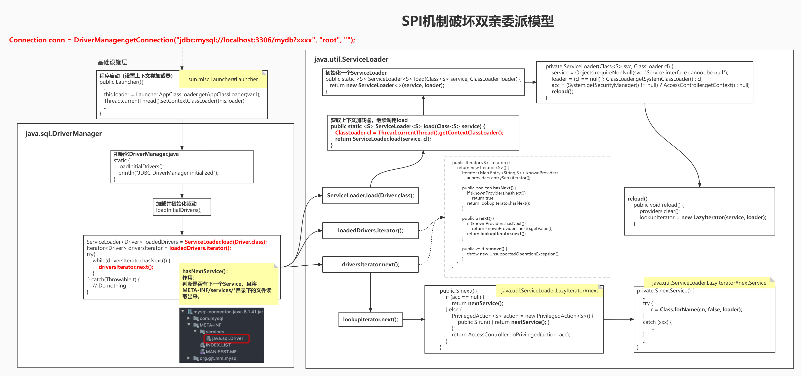

#### 第三种方式

为了满足热部署、不停机更新需求。OSGI 就是利用自定义的类加载器机制来完成模块化热部署，而它实现的类加载机制就没有完全遵循自下而上的委托，有很多平级之间的类加载器查找，具体就不展开了，有兴趣可以自行研究一下。

### 1.3 运行时数据区

整个JVM构成里面，由三部分组成：类加载系统、**运行时数据区**、执行引擎

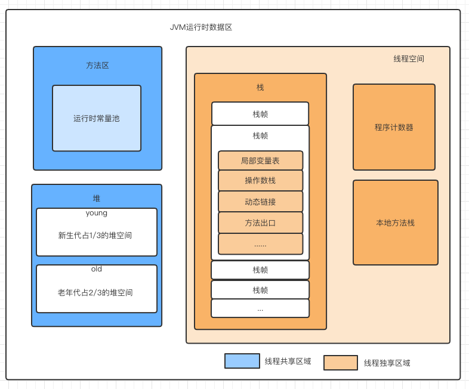

按照线程使用情况和职责分成两大类

- 线程独享 （程序执行区域）
  - 不需要垃圾回收
  - 虚拟机栈、本地方法栈、程序计数器
- 线程共享 （数据存储区域）
  - 垃圾回收
  - 存储类的静态数据和对象数据
  - 堆和方法区

#### 1.3.1 堆

Java堆在JVM启动时创建内存区域去实现对象、数组与运行时常量的内存分配，它是虚拟机管理最大的，也是垃圾回收的主要内存区域 。

#### **内存划分：**

**核心逻辑就是三大假说，基于程序运行情况进行不断的优化设计。**

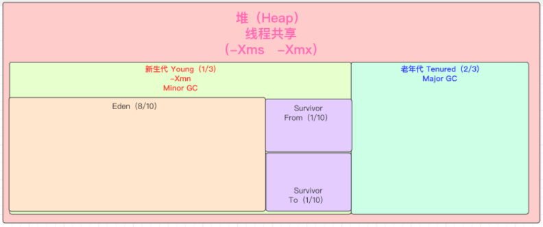

**堆内存为什么会存在新生代和老年代？**

**分代收集理论：当前商业虚拟机的垃圾收集器，大多数都遵循了“分代收集”（Generational Collection）的理论进行设计，分代收集名为理论，实质是一套符合大多数程序运行实际情况的经验法则**，它建立在两个分代假说之上：

- 弱分代假说（Weak Generational Hypothesis）：绝大多数对象都是朝生夕灭的。
- 强分代假说（Strong Generational Hypothesis）：熬过越多次垃圾收集过程的对象就越难以消亡。

这两个分代假说共同奠定了多款常用的垃圾收集器的一致的设计原则：收集器应该将Java堆划分出不同的区域，然后将回收对象依据其年龄（年龄即对象熬过垃圾收集过程的次数）分配到不同的区域之中存储。

- 如果一个区域中大多数对象都是朝生夕灭，难以熬过垃圾收集过程的话，那么把它们集中放在一起，每次回收时只关注如何保留少量存活而不是去标记那些大量将要被回收的对象，就能**以较低代价回收到大量的空间；**
- 如果剩下的都是难以消亡的对象，那把它们集中放在一块，虚拟机便可以使用**较低的频率来回收这个区域。**

这就同时**兼顾了垃圾收集的时间开销和内存的空间有效利用**。

**为什么新生代里面需要有两个Survivor区域呢？**

- 这个咱们在垃圾收集器小节进行解释

#### **内存模型变迁：**

- JDK1.7：

  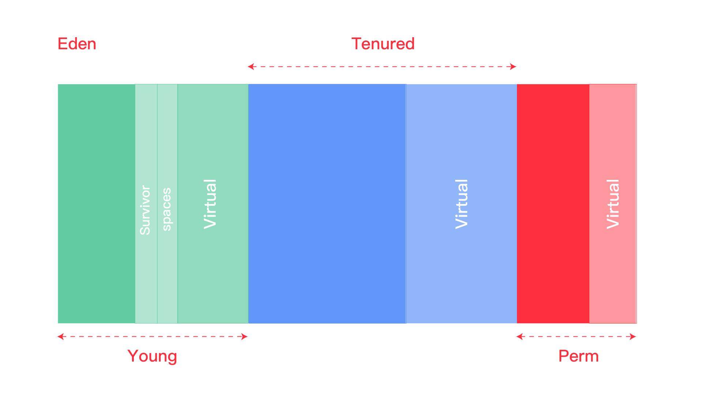

  - Young 年轻区 ：主要保存年轻对象，分为三部分，Eden区、两个Survivor区。
  - Tenured 年老区 ：主要保存年长对象，当对象在Young复制转移一定的次数后，对象就会被转移到Tenured区。
  - Perm 永久区 ：主要保存class、method、filed对象，这部份的空间一般不会溢出，除非一次性加载了很多的类，不过在涉及到热部署的应用服务器的时候，有时候会遇到OOM : PermGen space 的错误。
  - Virtual区： 最大内存和初始内存的差值，就是Virtual区。
- JDK1.8：

  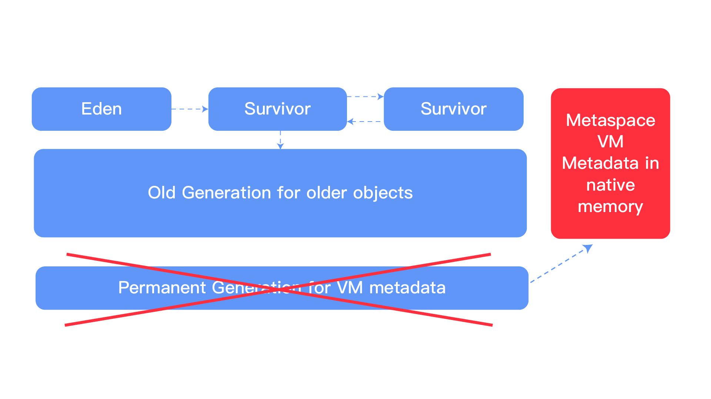

  - 由2部分组成，新生代（Eden + 2*Survivor ） + 年老代（OldGen ）
  - JDK1.8中变化最大是，的Perm永久区用Metaspace进行了替换
  - 注意：Metaspace所占用的内存空间不是在虚拟机内部，而是在本地内存空间中。区别于JDK1.7
- JDK1.9：

  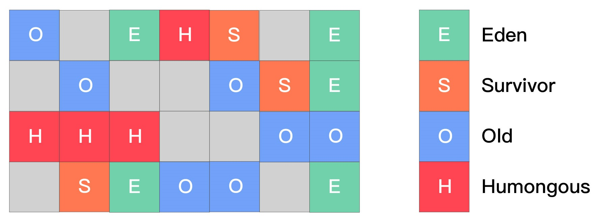

  - 取消新生代、老年代的物理划分
  - 将堆划分为若干个区域（Region），这些区域中包含了有逻辑上的新生代、老年代区域

> 储物收纳


#### 内存信息案例：

```java
package com.hero.jvm.memory;

/**
 * -Xms100m -Xmx100m
 */
public class HeapDemo {
    public static void main(String[] args) {
        System.out.println("======start=========");
        try {
            Thread.sleep(1000000L);
        } catch (InterruptedException e) {
            e.printStackTrace();
        }
        System.out.println("========end=========");
    }
}
```

#### JDK6堆内存结构

```text
C:\develop\java\jdk1.6.0_45\bin\javac  HeapDemo.java
C:\develop\java\jdk1.6.0_45\bin\java -Xms100m -Xmx100m HeapDemo
C:\develop\java\jdk1.6.0_45\bin\jmap -heap 3612
```

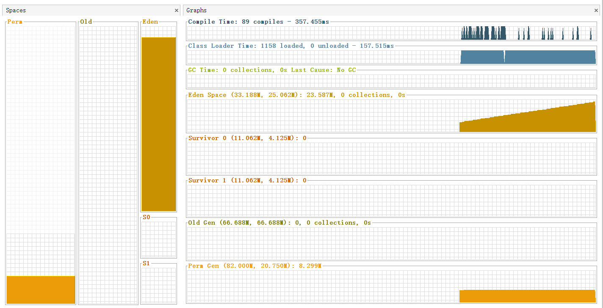


#### JDK7堆内存结构

```text
C:\develop\java\jdk1.7.0_80\bin\javac  HeapDemo.java
C:\develop\java\jdk1.7.0_80\bin\java -Xms100m -Xmx100m HeapDemo
C:\develop\java\jdk1.7.0_80\bin\jmap -heap 10420
```

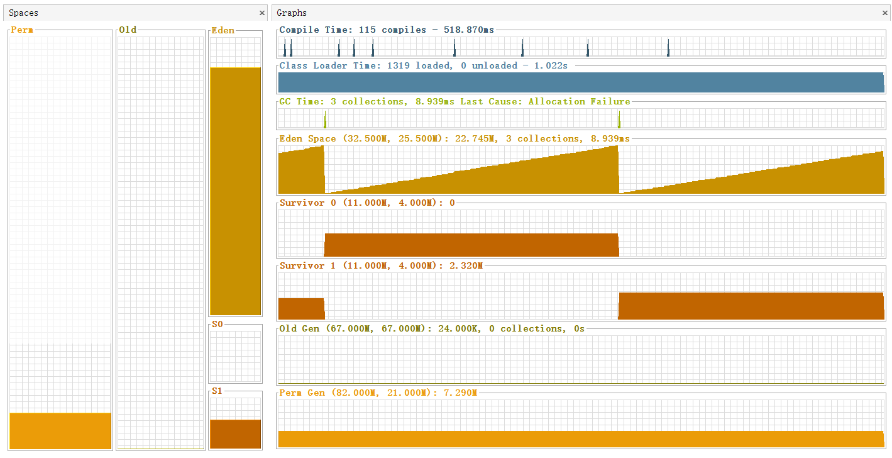

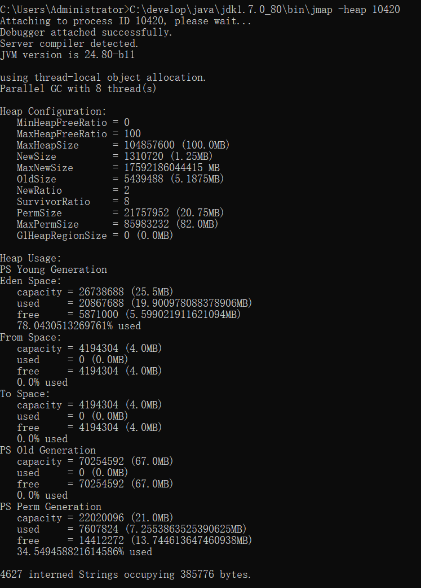

#### JDK8堆内存结构

```text
C:\develop\java\jdk1.8.0_251\bin\javac  HeapDemo.java
C:\develop\java\jdk1.8.0_251\bin\java -Xms100m -Xmx100m HeapDemo
C:\develop\java\jdk1.8.0_251\bin\jmap -heap 18276
```

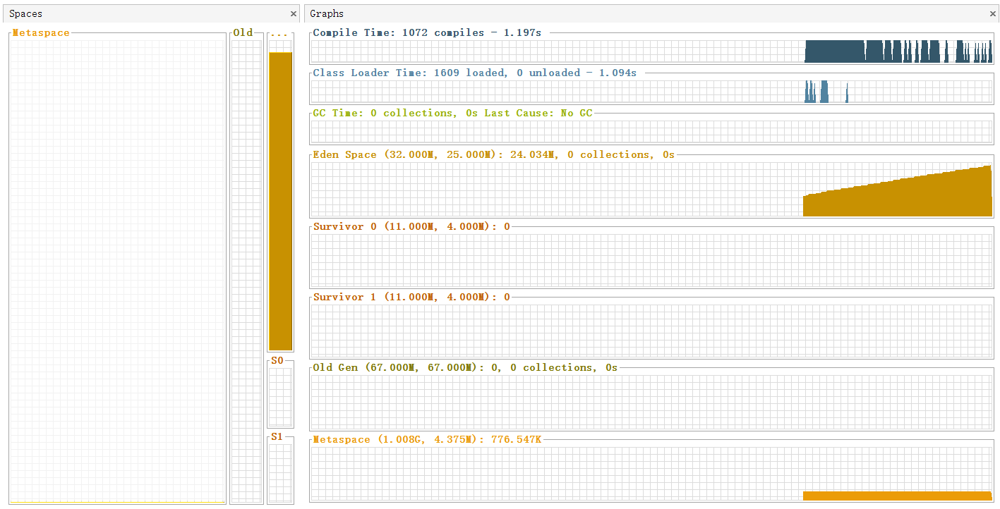


#### JDK11堆内存结构

```text
C:\develop\java\jdk-11.0.7\bin\javac  HeapDemo.java
C:\develop\java\jdk-11.0.7\bin\java -Xms100m -Xmx100m HeapDemo
C:\develop\java\jdk-11.0.7\bin\jhsdb jmap --heap --pid 19380
```


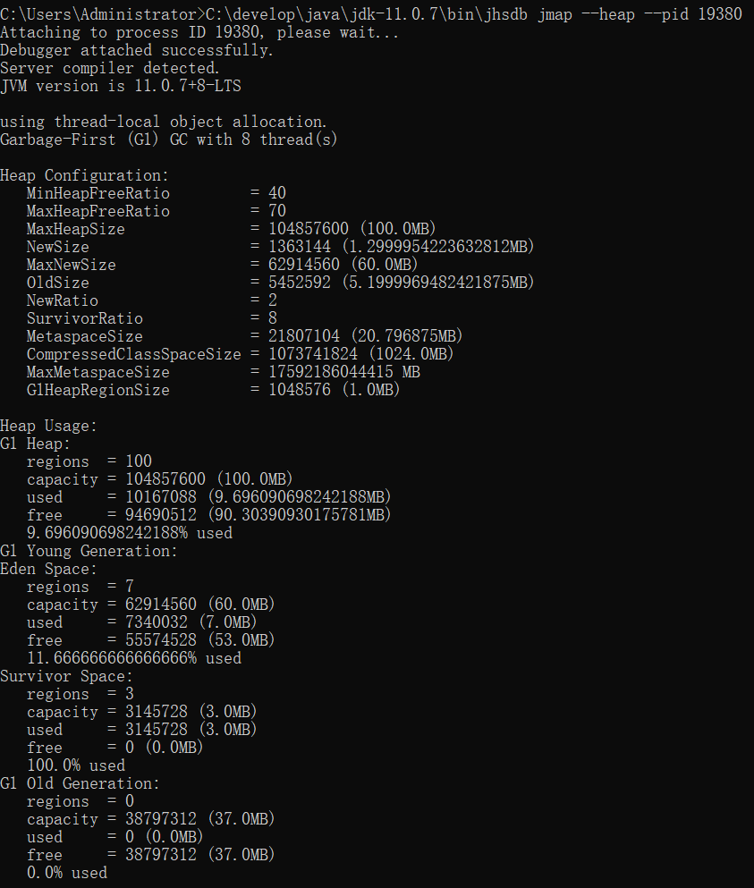

#### 1.3.2 虚拟机栈

#### 1）栈帧是什么？

栈帧(Stack Frame)是用于支持虚拟机进行**方法执行**的数据结构。

栈帧存储了方法的<font color="red">局部变量表、操作数栈、动态连接和方法返回地址</font>等信息。每一个方法从调用至执行完成的过程，都对应着一个栈帧在虚拟机栈里从入栈到出栈的过程。

栈内存为线程私有的空间，每个线程都会创建私有的栈内存，生命周期与线程相同，每个Java方法在执行的时候都会创建一个<font color="red">栈帧（Stack Frame）</font>。栈内存大小决定了方法调用的深度，栈内存过小则会导致方法调用的深度较小，如递归调用的次数较少。


#### 2）当前栈帧

一个线程中方法的调用链可能会很长，所以会有很多栈帧。只有位于JVM虚拟机栈栈顶的元素才是有效的，即称为**当前栈帧**，与这个栈帧相关连的方法称为**当前方法**，定义这个方法的类叫做**当前类**。

执行引擎运行的所有**字节码指令**都只针对**当前栈帧**进行操作。如果当前方法调用了其他方法，或者当前方法执行结束，那这个方法的栈帧就不再是当前栈帧了。

#### 3）什么时候创建栈帧

调用新的方法时，新的栈帧也会随之创建。并且随着程序控制权转移到新方法，新的栈帧成为了当前栈帧。方法返回之际，原栈帧会返回方法的执行结果给之前的栈帧(返回给方法调用者)，随后虚拟机将会丢弃此栈帧。

#### 4）栈异常的两种情况：

- 如果线程请求的栈深度大于虚拟机所允许的深度（Xss默认1m），会抛出StackOverflowError异常
- 如果在创建新的线程时，没有足够的内存去创建对应的虚拟机栈，会抛出OutOfMemoryError异常【不一定】

#### 5）栈异常案例：

如果线程请求的栈深度大于虚拟机所允许的深度，将会抛出**`StackOverflowError`**异常（-Xss）；

```java
package com.hero.jvm.memory;
 
public class StackErrorMock {
    private static int index = 1;
 
    public void call(){
        index++;
        call();
    }
 
    public static void main(String[] args) {
        StackErrorMock mock = new StackErrorMock();
        try {
            mock.call();
        }catch (Throwable e){
            System.out.println("Stack deep : "+index);
            e.printStackTrace();
        }
    }
}
```

```text
C:\develop\java\jdk1.8.0_251\bin\javac StackErrorMock.java
C:\develop\java\jdk1.8.0_251\bin\java -Xss1m StackErrorMock
C:\develop\java\jdk1.8.0_251\bin\java -Xss256k StackErrorMock
```


**补充案例：用来演示大量创建线程撑爆内存会发生什么！**

- 思考题：如果创建海量线程线程的时候，同时每个线程疯狂递归，请问到底是先OOM还是StackOverflowError？

```java
public class TestThread {
    public static void main(String[] args) {
        for (int i = 0; i < 100000; i++) {
            new Thread("Thread-" + i) {
                @Override
                public void run() {
                    try {
                        String name = Thread.currentThread().getName();
                        System.out.println(name);
                        recurive(30000);
                        TimeUnit.SECONDS.sleep(1);
                    } catch (InterruptedException e) {
                        e.printStackTrace();
                    }
                    System.out.println();
                }
            }.start();
        }
    }
    public static void recurive(double d){
        if (d ==0)
            return;
        recurive(d - 1);
    }
}
```

#### 1.3.3 本地方法栈

**本地方法栈**和**虚拟机栈**相似，区别就是虚拟机栈为虚拟机执行**Java服务（字节码服务）**，而本地方法栈为虚拟机使用到的**Native方法（比如C++方法）服务**。

简单地讲，一个Native Method就是一个Java调用非Java代码的接口。

```java
 public class IHaveNatives
    {
      native public void Native1( int x ) ;
      native static public long Native2() ;
      native synchronized private float Native3( Object o ) ;
      native void Native4( int[] ary ) throws Exception ;
  }
```

**为什么需要本地方法？**

Java是一门高级语言，我们不直接与操作系统资源、系统硬件打交道。如果想要直接与操作系统与硬件打交道，就需要使用到本地方法了。说白了，Java可以直接通过native方法调用cpp编写的接口！多线程底层就是这么实现的，在多线程部分我们会看一下Thread实现的源码，到时候就可以理解了。

#### 1.3.4 方法区

方法区（Method Area）是可供各个线程共享的运行时内存区域，方法区本质上是Java语言**编译后代码存储区域**，它存储每一个类的结构信息，例如：**运行时常量池**、成员变量、方法数据、构造方法和普通方法的字节码指令等内容。很多语言都有类似区域。

方法区的具体实现有两种：**永久代（PermGen）**、**元空间（Metaspace）**

#### 1）方法区存储什么数据？

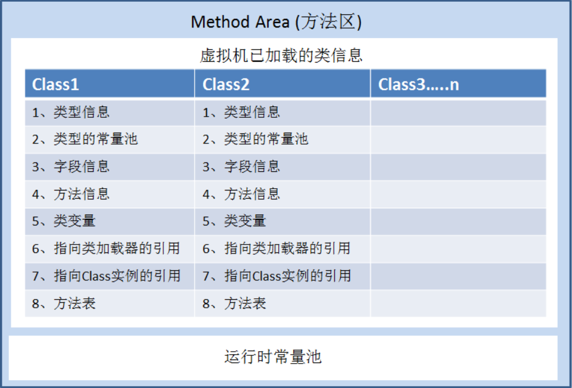

主要有如下三种类型

- 第一：Class
  1. 类型信息，比如Class（com.hero.User类）
  2. 方法信息，比如Method（方法名称、方法参数列表、方法返回值信息）
  3. 字段信息，比如Field（字段类型，字段名称需要特殊设置才能保存的住）
  4. 类变量（静态变量）：JDK1.7之后，转移到堆中存储
  5. 方法表（方法调用的时候） 在A类的main方法中去调用B类的method1方法，是根据B类的方法表去查找合适的方法，进行调用的。
- 第二：运行时常量池（字符串常量池）：从class中的常量池加载而来，JDK1.7之后，转移到堆中存储
  - 字面量类型
  - 引用类型-->内存地址
- 第三：JIT编译器编译之后的代码缓存

如果需要访问方法区中类的其他信息，都必须先获得Class对象，才能取访问该Class对象关联的方法信息或者字段信息。

#### 2）永久代和元空间的区别是什么？

1. JDK1.8之前使用的方法区实现是**永久代**，JDK1.8及以后使用的方法区实现是**元空间**。
2. **存储位置不同：**
   - **永久代**所使用的内存区域是**JVM进程所使用的区域**，它的大小受整个JVM的大小所限制。
   - **元空间**所使用的内存区域是物理内存区域。那么元空间的使用大小只会受物理内存大小的限制。
3. **存储内容不同：**
   - 永久代存储的信息基本上就是上面方法区存储内容中的数据。
   - 元空间只存储类的元信息，而**静态变量和运行时常量池都挪到堆中**。

#### 3）为什么要使用元空间来替换永久代？

1. **字符串存在永久代中，容易出现性能问题和永久代内存溢出。**
2. 类及方法的信息等比较难确定其大小，因此对于永久代的大小指定比较困难，太小容易出现永久代溢出，太大则容易导致老年代溢出。
3. 永久代会为 GC 带来不必要的复杂度，并且回收效率偏低。
4. Oracle 计划将HotSpot 与 JRockit 合二为一。

**方法区实现变迁历史：**

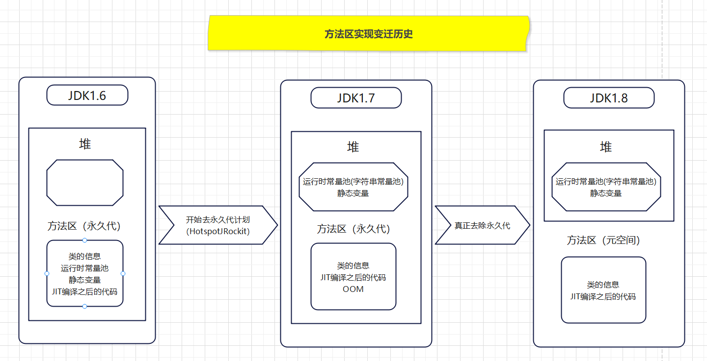

> 移除永久代的工作从JDK1.7就开始了。JDK1.7中，存储在永久代的部分数据就已经转移到了Java Heap。但永久代仍存在于JDK1.7中，并没完全移除，譬如：字面量转移到了java heap；类的静态变量(class statics)转移到了java heap。

#### 4）字符串OOM异常案例

#### 案例代码

以下这段程序以2的指数级不断的生成新的字符串，这样可以比较快速的消耗内存：

```java
package com.hero.jvm.memory; 
import java.util.ArrayList;
import java.util.List; 

public class StringOomMock {  
    static String  base = "string";  
    public static void main(String[] args) {  
        List<String> list = new ArrayList<String>();  
        for (int i=0;i< Integer.MAX_VALUE;i++){  
            String str = base + base;  
            base = str;  
            list.add(str.intern());  
        }  
    }
}
```

#### JDK1.6

```text
C:\develop\java\jdk1.6.0_45\bin\javac  StringOomMock.java
C:\develop\java\jdk1.6.0_45\bin\java -XX:PermSize=8m -XX:MaxPermSize=8m -Xmx16m StringOomMock
```

- JDK 1.6 的运行结果：

  
- 在JDK 1.6下，会出现永久代的内存溢出。

#### JDK1.7

```text
C:\develop\java\jdk1.7.0_80\bin\javac  StringOomMock.java
C:\develop\java\jdk1.7.0_80\bin\java -XX:PermSize=8m -XX:MaxPermSize=8m -Xmx16m StringOomMock
```

- JDK 1.7的运行结果：

  
- 在JDK 1.7中，会出现**堆内存溢出**。
- 结论是：**JDK 1.7 已经将字符串常量由永久代转移到堆中。**

#### JDK1.8+

```text
C:\develop\java\jdk1.8.0_251\bin\javac  StringOomMock.java
C:\develop\java\jdk1.8.0_251\bin\java -XX:PermSize=8m -XX:MaxPermSize=8m -Xmx16m StringOomMock
```

- JDK 1.8的运行结果：

  
- 在JDK 1.8 中，也会出现**堆内存溢出**，并且显示 JDK 1.8中 **PermSize 和 MaxPermGen 已经无效**。
- 结论是：**可以验证  JDK 1.8 中已经不存在永久代的结论。**

#### 1.3.5 字符串常量池

#### 1）三种常量池的比较

**class常量池：一个class文件只有一个class常量池**

- 字面量：数值型（int、float、long、double）、双引号引起来的字符串值等
- 符号引用：Class、Method、Field等

**运行时常量池：一个class对象有一个运行时常量池**

- 字面量：数值型（int、float、long、double）、双引号引起来的字符串值等
- 符号引用：Class、Method、Field等

**字符串常量池：全局只有一个字符串常量池**

- 双引号引起来的字符串值

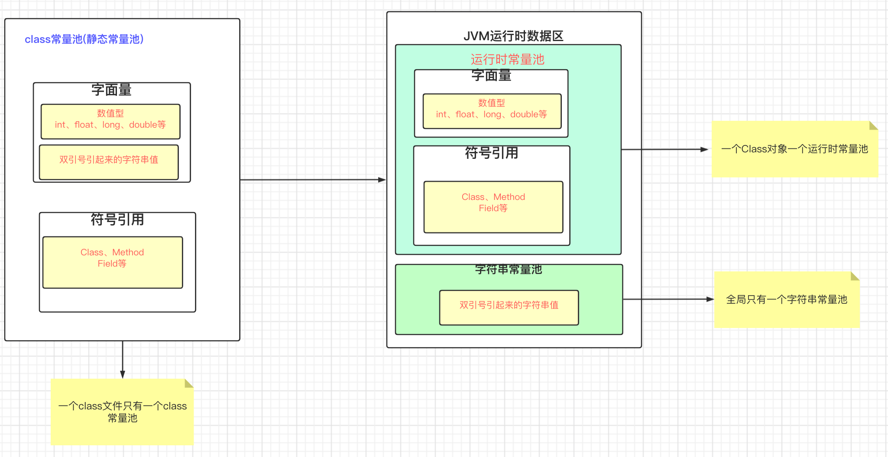

#### 2）字符串常量池如何存储数据？

为了提高匹配速度， 即更快的查找某个字符串是否存在于常量池 Java 在设计字符串常量池的时候，还搞了一张StringTable， StringTable里面保存了**字符串的引用**。StringTable类似于HashTable（哈希表）。在JDK1.7+，StringTable可以通过参数指定`-XX:StringTableSize=99991`

**什么是哈希表呢？**

哈希表（Hash table，也叫散列表），是根据关键码值(Key value)而直接进行访问的数据结构。也就是说，它通过把关键码值映射到表中一个位置来访问记录，以加快查找的速度。这个映射函数叫做散列函数，存放记录的数组叫做散列表。

**哈希表本质上是一个数组+链表**

**目的 : 为了加快数据查找的速度。**

存在问题：hash冲突问题，一旦出现冲突，那么就会形成链表，链表的特点是增删快，但查询慢。

> 数组下标计算公式：hash(字符串) % 数组长度
> 数组中存储的是Entry，通过指针next形成链表


```java
HashMap<String, Integer> map = new HashMap<>();
map.put("hello", 53);
map.put("world", 35);
map.put("java", 55);
map.put("world", 52);
map.put("通话", 51);
map.put("重地", 55);
```

#### 3）字符串常量池如何查找字符串：

- 根据字符串的hashcode找到对应entry
- 如果没有冲突，它可能只是一个entry
- 如何有冲突，它可能是一个entry的链表，然后Java再遍历链表，匹配引用对应的字符串
- 如果找到字符串，返回引用
- 如果找不到字符串，在使用intern()方法的时候，会将intern()方法调用者的引用放入到stringtable中


#### 4）字符串常量池案例

```java
public class StringTableDemo {
    public static void main(String[] args) {
        HashMap<String, Integer> map = new HashMap<>();
        map.put("hello", 53);
        map.put("world", 35);
        map.put("java", 55);
        map.put("world", 52);
        map.put("通话", 51);
        map.put("重地", 55);
        //出现哈希冲突怎么办？
        //System.out.println("map = " + map);//
        test();
    }
    public static void test() {
        String str1 = "abc";
        String str2 = new String("abc");
        System.out.println(str1 == str2);//false

        String str3 = new String("abc");
        System.out.println(str3 == str2);//false

        String str4 = "a" + "b";
        System.out.println(str4 == "ab");//true

        String s1 = "a";
        String s2 = "b";
        String str6 = s1 + s2;
        System.out.println(str6 == "ab");//false

        String str7 = "abc".substring(0,2);
        System.out.println(str7 == "ab");//false

        String str8 = "abc".toUpperCase();
        System.out.println(str8 == "ABC");//false

        String s5 = "a";
        String s6 = "abc";
        String s7 = s5 + "bc";
        System.out.println(s6 == s7.intern());//true
    }
}
```

总结：

- 单独使用””引号创建的字符串都是常量，编译期就已经确定存储到String Pool中。
- 使用new String(“”)创建的对象会存储到heap中，是运行期新创建的。
- 使用只包含常量的字符串连接符如”aa”+”bb”创建的也是常量，编译期就能确定已经存储到String Pool中。
- 使用包含变量的字符串连接如”aa”+s创建的对象是运行期才创建的，存储到heap中。
- 运行期调用String的intern()方法可以向String Pool中动态添加对象。

#### 1.3.6 程序计数器

<font color="red">程序计数器（Program Counter Register），也叫PC寄存器</font>，是一块较小的内存空间，它可以看作是**当前线程所执行的字节码指令的行号指示器**。字节码解释器的工作就是通过改变这个计数器的值来选取下一条需要执行的字节码指令。**分支，循环，跳转，异常处理，线程回复等都需要依赖这个计数器来完成。**

**为什么需要程序计数器？**

由于Java虚拟机的多线程是通过线程轮流切换并分配处理器执行时间的方式来实现的，在任何一个确定的时刻，一个处理器（针对多核处理器来说是一个内核）都只会执行一条线程中的指令。因此，为了线程切换（**系统上下文切换**）后能恢复到正确的执行位置，每条线程都需要有一个独立的程序计数器，各条线程之间计数器互不影响，独立存储，我们称这类内存区域为“线程私有”的内存。

**存储的什么数据？**

如果一个线程正在执行的是一个Java方法，这个计数器记录的是正在执行的虚拟机字节码指令的地址；如果正在执行的是一个Native方法，这个计数器的值则为空。

**异常：**<font color="red">此内存区域是唯一一个在Java的虚拟机规范中没有规定任何OutOfMemoryError异常情况的区域。</font>

#### 1.3.7 直接内存

直接内存并不是虚拟机运行时数据区的一部分，也不是Java 虚拟机规范中定义的内存区域。在JDK1.4 中新加入了NIO(New Input/Output)类，引入了一种基于通道(Channel)与缓冲区（Buffer）的I/O 方式，它可以使用native 函数库直接分配堆外内存，然后通过一个存储在Java堆中的**DirectByteBuffer** 对象作为这块内存的引用进行操作。这样能在一些场景中显著提高性能，因为避免了在Java堆和Native堆中来回复制数据。

本机直接内存的分配不会受到Java 堆大小的限制，受到本机总内存大小限制。

**直接内存（堆外内存）与堆内存比较：**

- 直接内存申请空间耗费更高的性能，当频繁申请到一定量时尤为明显
- 直接内存IO读写的性能要优于普通的堆内存，在多次读写操作的情况下差异明显

#### 直接内存案例：

```java
package com.hero.jvm.memory;

import java.nio.ByteBuffer;

public class ByteBufferCompare {
    public static void main(String[] args) {
        //allocateCompare();   //分配比较
        operateCompare();    //读写比较
    }

    /**
     * 直接内存 和 堆内存的 分配空间比较
     * 结论： 在数据量提升时，直接内存相比非直接内的申请，有很严重的性能问题
     */
    public static void allocateCompare() {
        int time = 1000 * 10000;    //操作次数,1千万
        long st = System.currentTimeMillis();
        for (int i = 0; i < time; i++) {

            //ByteBuffer.allocate(int capacity)   分配一个新的字节缓冲区。
            ByteBuffer buffer = ByteBuffer.allocate(2);      //非直接内存分配申请
        }
        long et = System.currentTimeMillis();

        System.out.println("在进行" + time + "次分配操作时，堆内存 分配耗时:" + (et - st) + "ms");

        long st_heap = System.currentTimeMillis();
        for (int i = 0; i < time; i++) {
            //ByteBuffer.allocateDirect(int capacity) 分配新的直接字节缓冲区。
            ByteBuffer buffer = ByteBuffer.allocateDirect(2); //直接内存分配申请
        }
        long et_direct = System.currentTimeMillis();
        System.out.println("在进行" + time + "次分配操作时，直接内存 分配耗时:" + (et_direct - st_heap) + "ms");

    }

    /**
     * 直接内存 和 堆内存的 读写性能比较
     * 结论：直接内存在直接的IO 操作上，在频繁的读写时 会有显著的性能提升
     */
    public static void operateCompare() {
        int time = 10 * 10000 * 10000; //操作次数,10亿

        ByteBuffer buffer = ByteBuffer.allocate(2 * time);
        long st = System.currentTimeMillis();
        for (int i = 0; i < time; i++) {
            //  putChar(char value) 用来写入 char 值的相对 put 方法
            buffer.putChar('a');
        }
        buffer.flip();
        for (int i = 0; i < time; i++) {
            buffer.getChar();
        }
        long et = System.currentTimeMillis();

        System.out.println("在进行" + time + "次读写操作时，非直接内存读写耗时：" + (et - st) + "ms");

        ByteBuffer buffer_d = ByteBuffer.allocateDirect(2 * time);
        long st_direct = System.currentTimeMillis();

        for (int i = 0; i < time; i++) {
            //  putChar(char value) 用来写入 char 值的相对 put 方法
            buffer_d.putChar('a');
        }
        buffer_d.flip();
        for (int i = 0; i < time; i++) {
            buffer_d.getChar();
        }
        long et_direct = System.currentTimeMillis();

        System.out.println("在进行" + time + "次读写操作时，直接内存读写耗时:" + (et_direct - st_direct) + "ms");
    }

```

输出：

- 在进行10000000次分配操作时，**堆内存** 分配耗时:82ms
- 在进行10000000次分配操作时，**直接内存** 分配耗时:6817ms
- 在进行1000000000次读写操作时，**堆内存**  读写耗时：1137ms
- 在进行1000000000次读写操作时，**直接内存** 读写耗时:512ms

**为什么会是这样？**

从数据流的角度，来看

- 非直接内存作用链：本地IO –>直接内存–>非直接内存–>直接内存–>本地IO
- 直接内存作用链：本地IO–>直接内存–>本地IO

**直接内存的使用场景：**

- 有很大的数据需要存储，它的生命周期很长
- 适合频繁的IO操作，例如：网络并发场景

# 今日总结

## 01-JVM基本常识

- **什么是JVM？** 广义上的JVM是指一种规范，狭义上的JVM指的是Hotspot类的虚拟机实现 广义上的JVM是指一种规范，狭义上的JVM指的是Hotspot类的虚拟机实现
- Java语言与JVM的关系：Java语言编写程序生成class字节码在JVM虚拟机里执行。其他语言也可以比如Scala、Groovy
- **学习JVM主要学啥？**  类加载子系统 --> 运行时数据区 --> 一个对象的一生--> GC垃圾收集器 类加载子系统 --> 运行时数据区 --> 一个对象的一生--> GC垃圾收集器
- **学了JVM可以干啥？** JVM调优，底层能力 JVM调优，底层能力**决定** 上层建筑

## 02-类加载子系统

- **类加载四个时机：** 1.new、getstatic、putstatic、invokestatic。2.反射。3.初始化子类发现父类没有初始化时。4.main函数的类
- **类加载主要过程：**  加载 -> 验证 -> 准备 -> 解析 ->  初始化 -> 使用 -> 卸载
- **类加载主要做了三件事：**
  - 全限定名称                    ==>    二进制字节流加载class文件
  - 字节流的静态数据结构 ==>    方法区的运行时数据结构
  - 创建字节码Class对象
- **可以从哪些途径加载字节码：**
  - Jar、war
  - JSP生成的class
  - 数据库中二进制字节流
  - 网络中二进制字节流
  - 动态代理生成的二进制字节流
- **类加载器有哪些？**
  - 启动类加载器BootstrapClassLoader，扩展类加载器ExtensionClassLoader
  - 应用类加载器ApplicationClassLoader，自定义类加载器UserClassLoader
  - 检查顺序自底向上，加载顺序自顶向下
- **什么是双亲委派？** 当一个类加载器收到加载任务，会先交给其父类加载器去加载 当一个类加载器收到加载任务，会先交给其父类加载器去加载
- **为何要打破双亲委派？**  父类加载器加载范围受限，无法加载的类需要委托子类加载器去完成加载 父类加载器加载范围受限，无法加载的类需要委托子类加载器去完成加载

## 03-运行时数据区

- **堆：** JVM启动是创建的最大的一块内存区域，对象，数组，运行时常量池都在这里 JVM启动是创建的最大的一块内存区域，对象，数组，运行时常量池都在这里
  - 内存划分：Eden、2个Survivor、老年代
  - **为什么要划分新生代与老年代？**  基于分代收集理论里的量大假说，弱分代和强分代假说。 基于分代收集理论里的量大假说，弱分代和强分代假说。**提升垃圾收集的效率。**
  - 内存模型变迁史：JDK1.7  ---取消永久代，多了元空间---> JDK1.8 ---取消新生代与老年代物理划分---> JDK1.9
- **虚拟机栈：**  栈空间为线程私有，每个线程都会创建栈内存，生命周期与线程相同 栈空间为线程私有，每个线程都会创建栈内存，生命周期与线程相同
  - 线程内的栈内存占满了会出现StackOverflowError
  - **栈帧是什么？** **栈帧(Stack Frame)是用于支持虚拟机进行** **方法执行**的数据结构。
- **本地方法栈：** 与虚拟机栈类似，区别在于本地方法栈为本地方法服务，也就是native方法 与虚拟机栈类似，区别在于本地方法栈为本地方法服务，也就是native方法
- **方法区：**  方法区的实现有两种：永久代（PermGen）、元空间（Metaspace） 方法区的实现有两种：永久代（PermGen）、元空间（Metaspace）
  - **方法区存什么数据？** 类型信息，方法信息，字段信息，类变量信息，方法表，指向类加载器的引用，指向Class实例的引用 类型信息，方法信息，字段信息，类变量信息，方法表，指向类加载器的引用，指向Class实例的引用
  - **永久代和元空间有什么区别？**
    - 存储位置不同
    - 存储内容不同
  - **为什么要使用元空间来替换永久代？**
    - 基于性能、稳定性、GC垃圾收集的复杂度考虑，当然也有Oracle收购了Java原因
- **字符串常量池**
  - 三种常量池：class常量池、运行时常量池、字符串常量池
  - **字符串常量池如何存储数据？****字符串常量池如何存储数据？** 使用哈希表【哈希冲突，哈希碰撞...】 使用哈希表【哈希冲突，哈希碰撞...】
  - **字符串常量池如何查找字符串？****字符串常量池如何查找字符串？** 类似于HashMap 类似于HashMap
- **程序计数器**
  - **存储什么数据？** 当前线程执行时的字节码指令地址 当前线程执行时的字节码指令地址
  - **为什么需要程序计数器？****为什么需要程序计数器？** 因为系统的上下文切换 因为系统的上下文切换
- **直接内存**
  - 相对堆内存，直接内存申请空间更耗时
  - 直接内存IO读写的性能要优于普通的堆内存
